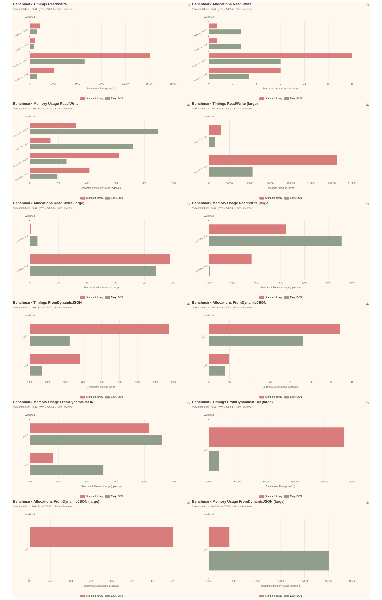
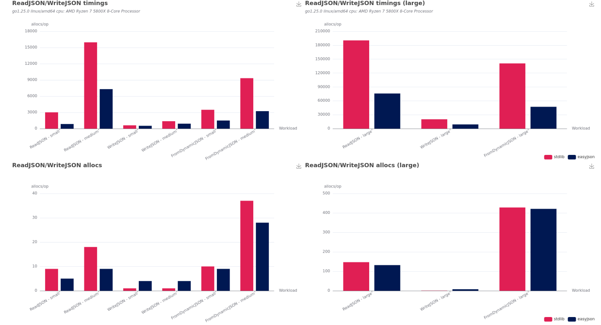

# benchmarks

**Disclaimer**: `go-openapi` has no affiliation with the providers of the tested libraries.

> Credits: the definition of the small, medium and large payloads has been taken from the benchmarks
> published at `github.com/goccy/go-json`. Thanks @goccy.  We'd love to include your library as one
> of our supported adapters.

This benchmark is not a competitive benchmark, but merely a way for us to ensure that
our "JSON adapter" feature runs with good performances and induces a reasonably low overhead.

Expected behavior: the `Adapter` layer is relatively thin:
it involves no extra allocation and its CPU impact is negligible when compared to the Marshal/Unmarshal tasks.

> NOTE: the `FromDynamicJSON` benchmark uses both source and target types supporting `easyjson`,
> which equates more or less to a deep copy of the original payload.
>
> Using `any` as a target would systematically route to the standard library and therefore, results
> wouldn't represent a fair comparison.

## go1.26.4



```sh
go version go1.26.4 linux/amd64

cpu: AMD Ryzen 7 5800X 8-Core Processor
```

## go1.25.0



```sh
go version go1.25.0 linux/amd64

cpu: AMD Ryzen 7 5800X 8-Core Processor
```


## Updating benchmarks & diagrams

```sh
go install github.com/fredbi/benchviz@latest

go test -v -bench . -run Bench -benchtime 30s  -benchmem -json > bench.json

benchviz -json -strict -png -o bench bench.json
```
