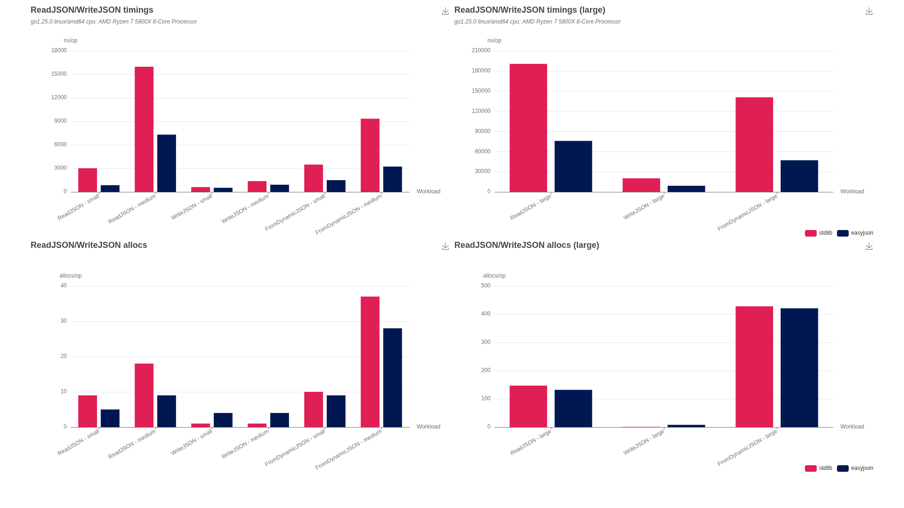

# benchmarks

Disclaimer: `go-openapi` has no affiliation with the providers of the tested libraries.

Credits: the definition of the small, medium and large payloads has been taken from the benchmarks
published at `github.com/goccy/go-json`. Thanks @goccy.  We'd love to include your library as one
of our supported adapters.

This benchmark is not a competitive benchmark, but merely a way for us to ensure that
our "JSON adapter" feature runs with good performances and induces a reasonably low overhead.

> Expected behaviour: the `Adapter` layer is relatively thin: it involves no extra allocation 
> and its CPU impact is negligible when compared to the Marshal/Unmarshal tasks.

> NOTE: the `FromDynamicJSON` benchmark uses both source and target types supporting `easyjson`,
> which equates more or less to a deep copy of the original payload.
>
> Using `any` as a target would systematically route to the standard library and therefore, results
> wouldn't represent a fair comparison.

## go1.25.0



```sh
go version go1.25.0 linux/amd64
```

```sh
go test -v -bench . -run Bench -benchtime 30s  -benchmem 
```

```
goos: linux
goarch: amd64
pkg: github.com/go-openapi/swag/jsonutils/adapters/testintegration/benchmarks
cpu: AMD Ryzen 7 5800X 8-Core Processor             
BenchmarkJSON
BenchmarkJSON/with_standard_library
BenchmarkJSON/with_standard_library/standard_ReadJSON_-_small
BenchmarkJSON/with_standard_library/standard_ReadJSON_-_small-16         	13005949	      3020 ns/op	  47.68 MB/s	     416 B/op	       9 allocs/op
BenchmarkJSON/with_standard_library/standard_WriteJSON_-_small
BenchmarkJSON/with_standard_library/standard_WriteJSON_-_small-16        	56078876	       614.1 ns/op	 214.94 MB/s	     144 B/op	       1 allocs/op
BenchmarkJSON/with_standard_library/standard_FromDynamicJSON_-_small
BenchmarkJSON/with_standard_library/standard_FromDynamicJSON_-_small-16  	10574182	      3487 ns/op	     560 B/op	      10 allocs/op
BenchmarkJSON/with_standard_library/standard_ReadJSON_-_medium
BenchmarkJSON/with_standard_library/standard_ReadJSON_-_medium-16        	 2235476	     15966 ns/op	 129.65 MB/s	     624 B/op	      18 allocs/op
BenchmarkJSON/with_standard_library/standard_WriteJSON_-_medium
BenchmarkJSON/with_standard_library/standard_WriteJSON_-_medium-16       	25711994	      1379 ns/op	 229.10 MB/s	     320 B/op	       1 allocs/op
BenchmarkJSON/with_standard_library/standard_FromDynamicJSON_-_medium
BenchmarkJSON/with_standard_library/standard_FromDynamicJSON_-_medium-16 	 4111292	      9339 ns/op	    1233 B/op	      37 allocs/op
BenchmarkJSON/with_standard_library/standard_ReadJSON_-_large
BenchmarkJSON/with_standard_library/standard_ReadJSON_-_large-16         	  180291	    190534 ns/op	 147.58 MB/s	    4435 B/op	     147 allocs/op
BenchmarkJSON/with_standard_library/standard_WriteJSON_-_large
BenchmarkJSON/with_standard_library/standard_WriteJSON_-_large-16        	 1783418	     20211 ns/op	 239.33 MB/s	    4871 B/op	       1 allocs/op
BenchmarkJSON/with_standard_library/standard_FromDynamicJSON_-_large
BenchmarkJSON/with_standard_library/standard_FromDynamicJSON_-_large-16  	  261943	    140796 ns/op	   15249 B/op	     428 allocs/op
BenchmarkJSON/with_easyjson_library
BenchmarkJSON/with_easyjson_library/easyjson_ReadJSON_-_small
BenchmarkJSON/with_easyjson_library/easyjson_ReadJSON_-_small-16         	43712187	       858.3 ns/op	 167.77 MB/s	     192 B/op	       5 allocs/op
BenchmarkJSON/with_easyjson_library/easyjson_WriteJSON_-_small
BenchmarkJSON/with_easyjson_library/easyjson_WriteJSON_-_small-16        	64595014	       524.5 ns/op	 251.68 MB/s	     720 B/op	       4 allocs/op
BenchmarkJSON/with_easyjson_library/easyjson_FromDynamicJSON_-_small
BenchmarkJSON/with_easyjson_library/easyjson_FromDynamicJSON_-_small-16  	22922629	      1500 ns/op	     913 B/op	       9 allocs/op
BenchmarkJSON/with_easyjson_library/easyjson_ReadJSON_-_medium
BenchmarkJSON/with_easyjson_library/easyjson_ReadJSON_-_medium-16        	 4939929	      7306 ns/op	 283.33 MB/s	     256 B/op	       9 allocs/op
BenchmarkJSON/with_easyjson_library/easyjson_WriteJSON_-_medium
BenchmarkJSON/with_easyjson_library/easyjson_WriteJSON_-_medium-16       	39401455	       917.5 ns/op	 344.40 MB/s	     897 B/op	       4 allocs/op
BenchmarkJSON/with_easyjson_library/easyjson_FromDynamicJSON_-_medium
BenchmarkJSON/with_easyjson_library/easyjson_FromDynamicJSON_-_medium-16 	 9979048	      3233 ns/op	    1322 B/op	      28 allocs/op
BenchmarkJSON/with_easyjson_library/easyjson_ReadJSON_-_large
BenchmarkJSON/with_easyjson_library/easyjson_ReadJSON_-_large-16         	  486135	     75891 ns/op	 370.51 MB/s	    3912 B/op	     132 allocs/op
BenchmarkJSON/with_easyjson_library/easyjson_WriteJSON_-_large
BenchmarkJSON/with_easyjson_library/easyjson_WriteJSON_-_large-16        	 3888386	      9140 ns/op	 529.20 MB/s	    5567 B/op	       8 allocs/op
BenchmarkJSON/with_easyjson_library/easyjson_FromDynamicJSON_-_large
BenchmarkJSON/with_easyjson_library/easyjson_FromDynamicJSON_-_large-16  	  717406	     47115 ns/op	   15496 B/op	     421 allocs/op
PASS
ok  	github.com/go-openapi/swag/jsonutils/adapters/testintegration/benchmarks	643.940s
```


## go1.25.0 greenteagc

```sh
go version go1.25.0 linux/amd64
```

```sh
GOEXPERIMENT=greenteagc go test -v -bench . -run Bench -benchtime 30s  -benchmem 
``` 

```
goos: linux
goarch: amd64
pkg: github.com/go-openapi/swag/jsonutils/adapters/testintegration/benchmarks
cpu: AMD Ryzen 7 5800X 8-Core Processor             
BenchmarkJSON
BenchmarkJSON/with_standard_library
BenchmarkJSON/with_standard_library/standard_ReadJSON_-_small
BenchmarkJSON/with_standard_library/standard_ReadJSON_-_small-16         	12759744	      2747 ns/op	  52.42 MB/s	     416 B/op	       9 allocs/op
BenchmarkJSON/with_standard_library/standard_WriteJSON_-_small
BenchmarkJSON/with_standard_library/standard_WriteJSON_-_small-16        	63616329	       577.5 ns/op	 228.59 MB/s	     144 B/op	       1 allocs/op
BenchmarkJSON/with_standard_library/standard_FromDynamicJSON_-_small
BenchmarkJSON/with_standard_library/standard_FromDynamicJSON_-_small-16  	10593036	      3308 ns/op	     560 B/op	      10 allocs/op
BenchmarkJSON/with_standard_library/standard_ReadJSON_-_medium
BenchmarkJSON/with_standard_library/standard_ReadJSON_-_medium-16        	 2195624	     16308 ns/op	 126.94 MB/s	     624 B/op	      18 allocs/op
BenchmarkJSON/with_standard_library/standard_WriteJSON_-_medium
BenchmarkJSON/with_standard_library/standard_WriteJSON_-_medium-16       	28557896	      1229 ns/op	 257.18 MB/s	     320 B/op	       1 allocs/op
BenchmarkJSON/with_standard_library/standard_FromDynamicJSON_-_medium
BenchmarkJSON/with_standard_library/standard_FromDynamicJSON_-_medium-16 	 3964765	      9088 ns/op	    1234 B/op	      37 allocs/op
BenchmarkJSON/with_standard_library/standard_ReadJSON_-_large
BenchmarkJSON/with_standard_library/standard_ReadJSON_-_large-16         	  189339	    193019 ns/op	 145.67 MB/s	    4435 B/op	     147 allocs/op
BenchmarkJSON/with_standard_library/standard_WriteJSON_-_large
BenchmarkJSON/with_standard_library/standard_WriteJSON_-_large-16        	 1998580	     17652 ns/op	 274.01 MB/s	    4870 B/op	       1 allocs/op
BenchmarkJSON/with_standard_library/standard_FromDynamicJSON_-_large
BenchmarkJSON/with_standard_library/standard_FromDynamicJSON_-_large-16  	  255865	    140575 ns/op	   15247 B/op	     428 allocs/op
BenchmarkJSON/with_easyjson_library
BenchmarkJSON/with_easyjson_library/easyjson_ReadJSON_-_small
BenchmarkJSON/with_easyjson_library/easyjson_ReadJSON_-_small-16         	44697164	       868.3 ns/op	 165.84 MB/s	     192 B/op	       5 allocs/op
BenchmarkJSON/with_easyjson_library/easyjson_WriteJSON_-_small
BenchmarkJSON/with_easyjson_library/easyjson_WriteJSON_-_small-16        	60345216	       534.8 ns/op	 246.80 MB/s	     720 B/op	       4 allocs/op
BenchmarkJSON/with_easyjson_library/easyjson_FromDynamicJSON_-_small
BenchmarkJSON/with_easyjson_library/easyjson_FromDynamicJSON_-_small-16  	26356634	      1477 ns/op	     913 B/op	       9 allocs/op
BenchmarkJSON/with_easyjson_library/easyjson_ReadJSON_-_medium
BenchmarkJSON/with_easyjson_library/easyjson_ReadJSON_-_medium-16        	 5074519	      7145 ns/op	 289.72 MB/s	     256 B/op	       9 allocs/op
BenchmarkJSON/with_easyjson_library/easyjson_WriteJSON_-_medium
BenchmarkJSON/with_easyjson_library/easyjson_WriteJSON_-_medium-16       	41205440	       867.0 ns/op	 364.46 MB/s	     897 B/op	       4 allocs/op
BenchmarkJSON/with_easyjson_library/easyjson_FromDynamicJSON_-_medium
BenchmarkJSON/with_easyjson_library/easyjson_FromDynamicJSON_-_medium-16 	11434189	      3068 ns/op	    1322 B/op	      28 allocs/op
BenchmarkJSON/with_easyjson_library/easyjson_ReadJSON_-_large
BenchmarkJSON/with_easyjson_library/easyjson_ReadJSON_-_large-16         	  471589	     76075 ns/op	 369.61 MB/s	    3912 B/op	     132 allocs/op
BenchmarkJSON/with_easyjson_library/easyjson_WriteJSON_-_large
BenchmarkJSON/with_easyjson_library/easyjson_WriteJSON_-_large-16        	 3816392	      9151 ns/op	 528.57 MB/s	    5565 B/op	       8 allocs/op
BenchmarkJSON/with_easyjson_library/easyjson_FromDynamicJSON_-_large
BenchmarkJSON/with_easyjson_library/easyjson_FromDynamicJSON_-_large-16  	  751338	     46537 ns/op	   15502 B/op	     421 allocs/op
PASS
ok  	github.com/go-openapi/swag/jsonutils/adapters/testintegration/benchmarks	644.394s
```
